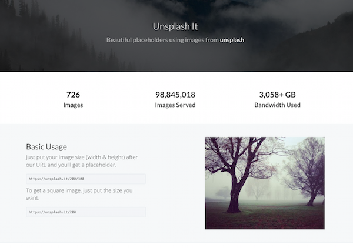

Recently I updated my we page and one of the nice features I included on it is the fact a random image is placed in the header for each page. These images are obtained from the great [unsplash](https://unsplash.com/), a *free (do whatever you want) high-resolution photos* project. As its slogan says, unsplash contains tons of really good images, both by its resolution and the photographies.

To embed the unsplash images in my web site I used the [unsplash.it](https://unsplash.it/) service, its slogan says *Beautiful placeholders using images from unsplash*.

It was created by  [David Marby](http://dmarby.se/) and [Nijiko Yonskai](https://github.com/Nijikokun) and the code is publicly available at the github [unsplash-it](https://github.com/DMarby/unsplash-it) repository (if you are interested it is a NodeJS based project).

But what does exactly unsplash.it? Basically it returns images from unsplash project with some steroids.

- Retrieve an image indicating the desired width and height: [https://unsplash.it/500/400](https://unsplash.it/500/400)
- Using a square image: [https://unsplash.it/500](https://unsplash.it/500)
- Get a random image: [https://unsplash.it/500/400?random](https://unsplash.it/500/400?random)
- or maybe grey styled: [https://unsplash.it/g/500/400?random](https://unsplash.it/g/500/400?random)
- Obtain a list of available images: [https://unsplash.it/list](https://unsplash.it/list)
- And retrieve a given image: [https://unsplash.it/500?image=123](https://unsplash.it/500?image=123)
- Maybe a bit blured: [https://unsplash.it/500?image=123&blur](https://unsplash.it/500?image=123&blur)
- And finally, cropping if desired: [https://unsplash.it/500?image=123&gravity=east](https://unsplash.it/500?image=123&gravity=east)

Yeah !!! [unsplash.it](https://unsplash.it/) is nice service easy and free to use.
